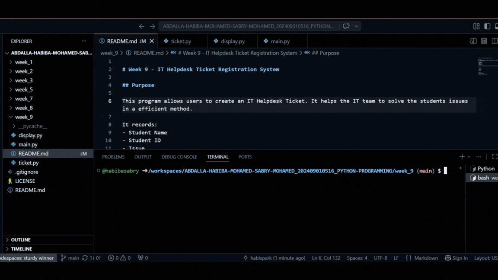

# Week 9 - IT Helpdesk Ticket Registration System

## Purpose

This program allows users to create an IT Helpdesk Ticket. It helps the IT team to solve the students issues in a efficient method. 

It records:
- Student Name
- Student ID
- Issue
- Location
- Priority Level

The program automatically assigns a technician based on the selected priority.

---

## Tech Stack

- Python 3
- VS Code
- GitHub

---

## Quick system snap gif
